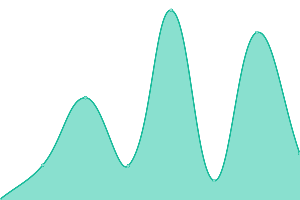

# [📈 Live Status](https://status.principia-web.se): <!--live status--> **🟩 All systems operational**

This repository contains the open-source uptime monitor and status page for [ROllerozxa](https://voxelmanip.se), powered by [Upptime](https://github.com/upptime/upptime).

With [Upptime](https://upptime.js.org), you can get your own unlimited and free uptime monitor and status page, powered entirely by a GitHub repository. We use [Issues](https://github.com/rollerozxa/uptime-test/issues) as incident reports, [Actions](https://github.com/rollerozxa/uptime-test/actions) as uptime monitors, and [Pages](https://status.principia-web.se) for the status page.

<!--start: status pages-->
<!-- This summary is generated by Upptime (https://github.com/upptime/upptime) -->
<!-- Do not edit this manually, your changes will be overwritten -->
<!-- prettier-ignore -->
| URL | Status | History | Response Time | Uptime |
| --- | ------ | ------- | ------------- | ------ |
|  [principia-web](https://principia-web.se) | 🟩 Up | [principia-web.yml](https://github.com/rollerozxa/uptime-test/commits/HEAD/history/principia-web.yml) | 

 654ms
     
 | 

<a href="https://status.voxelmanip.se/history/principia-web">98.63%</a>
    

|  [principia-web-archive](https://archive.principia-web.se) | 🟩 Up | [principia-web-archive.yml](https://github.com/rollerozxa/uptime-test/commits/HEAD/history/principia-web-archive.yml) | 

 587ms
     
 | 

<a href="https://status.voxelmanip.se/history/principia-web-archive">98.31%</a>
    

|  [voxelmanip.se](https://voxelmanip.se) | 🟩 Up | [voxelmanip-se.yml](https://github.com/rollerozxa/uptime-test/commits/HEAD/history/voxelmanip-se.yml) | 

 461ms
     
 | 

<a href="https://status.voxelmanip.se/history/voxelmanip-se">98.75%</a>
    

|  [Voxelmanip Forums](https://forum.voxelmanip.se) | 🟩 Up | [voxelmanip-forums.yml](https://github.com/rollerozxa/uptime-test/commits/HEAD/history/voxelmanip-forums.yml) | 

 426ms
     
 | 

<a href="https://status.voxelmanip.se/history/voxelmanip-forums">98.88%</a>
    

|  [Voxelmanip Wiki](https://wiki.voxelmanip.se) | 🟩 Up | [voxelmanip-wiki.yml](https://github.com/rollerozxa/uptime-test/commits/HEAD/history/voxelmanip-wiki.yml) | 

 454ms
     
 | 

<a href="https://status.voxelmanip.se/history/voxelmanip-wiki">98.89%</a>
    

<!--end: status pages-->

[**Visit our status website →**](https://status.principia-web.se)

## 📄 License

- Powered by: [Upptime](https://github.com/upptime/upptime)
- Code: [MIT](./LICENSE) © [ROllerozxa](https://voxelmanip.se)
- Data in the `./history` directory: [Open Database License](https://opendatacommons.org/licenses/odbl/1-0/)
